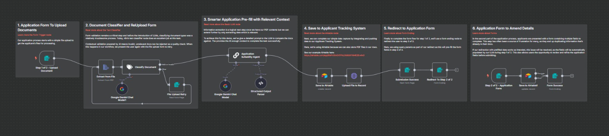

# 🪄📄 MagicFill – “Your Forms, Filled by Magic”

MagicFill is an AI-powered platform that simplifies form-filling for millions in India, especially in rural and underserved areas. It helps users to automatically filled the application form, ensures inclusive access to critical services by eliminating barriers caused by complex, form-based processes.

## ❓ Problem Statement
Millions in India, particularly in rural and underserved urban areas, face barriers to accessing essential services due to complex, form-based processes. These challenges include:
- 🛑 Forms that are digitally inaccessible to under-literate users.
- ⏳ Time-consuming and error-prone processes.
- 💸 Dependence on costly agents or cyber cafés.
- 🚫 Exclusion from welfare, banking, healthcare, housing, and education services.
- ⚠️ Errors and delays that strain public institutions.

There is an urgent need for a scalable, AI-driven platform that:
- 🤖 Simplifies form-filling.
- 📝 Auto-populates user details.
- 🔒 Offers a secure, user-friendly experience.
- 🌍 Ensures inclusive access to critical services for marginalized and underrepresented populations.

## 💡 Our Solution 
MagicFill addresses these challenges by providing:
- 🤖 **AI-Powered Form Filling**: Automatically fills complex government and institutional forms.
- ✍️ **Simplified Paperwork**: Converts tasks like KYC, rent agreements, resumes, affidavits, and legal forms into a quick, one-click process.
- 🔐 **Secure Digital Vault**: Stores documents with Aadhaar-authenticated access and auto-renewal alerts.
- 🏗️ **Modular and Scalable Architecture**: Allows easy integration with Common Service Centres (CSCs), DigiLocker, municipal portals, and NGOs.
- ⏱️ **Time Efficiency**: Saves 90% of form-filling time.
1. 📈 **Increased Access**: Boosts access to schemes and services by 5x.
2. 🤝 **Government Support**: Fully supported by the government at zero cost to citizens.
3. 🌟 **Transparency and Inclusion**: Promotes transparency and inclusion in e-governance.

## 🌟 Features
1. 🤖 **AI-Powered Form Filling**: Automatically fills complex forms with high accuracy using advanced AI models like Google Gemini.
2. 🗂️ **Document Classification**: Validates and classifies uploaded documents to ensure relevance and quality.
3. 🔐 **Digital Vault**: Securely stores user documents with Aadhaar-authenticated access.
4. ⏳ **Time-Saving**: Reduces form-filling time by 90%.
5. 🌍 **Inclusive Access**: Boosts access to schemes and services by 5x.
6. 💸 **Zero Cost**: Fully government-supported and free for citizens.

## 🛠️ Workflow
The MagicFill project workflow is designed to streamline the form-filling process using advanced AI and automation tools. Below is the detailed workflow:

See the video here: https://www.youtube.com/watch?v=4ybHfG3jo4w

Or,

1. 📤 **Step 1 of 2: Submit Your Document**:
   - Users upload their documents (e.g., Aadhaar Card) in PDF format.
   - The form ensures that only valid, password-free PDFs are accepted.

2. 🗂️ **Classify Document**:
   - Uses Google Gemini to classify the document as valid or invalid.
   - Invalid documents trigger a retry process where users can re-upload their files. If valid, the workflow proceeds to the next step for relevant text extraction.

3. 📝 **Extract from File**:
   - Extracts relevant data from the uploaded PDF file for further processing.

4. 🤖 **Application Suitability Agent**:
   - Generates a structured output, including fields like Name, Address, Email, Phone number, etc.

5. 💾 **Save to Airtable**:
   - Stores the extracted data in Airtable, an applicant tracking system.

6. 🔄 **Redirect to Step 2 of 2**:
   - Redirects users to the second step of the application process. The government portal or any other important application form is automatically filled by Gemini using the extracted data.

7. 🖊️ **Step 2 of 2: Application Form**:
   - Users review and amend the pre-filled application form.
   - Fields include Name, Address, Email, Telephone, Education, etc.

8. ✅ **Form Success**:
   - Displays a success message to the user, confirming the completion of the application process.

## 🛠️ Technologies Used
1. 🤖 **Artificial Intelligence**: Utilizes advanced AI models like Google Gemini for intelligent form-filling and document classification.
2. 🔄 **n8n Workflow Automation**: Automates processes like document extraction, classification, and data storage.
3. 🗂️ **Airtable Integration**: Manages and stores applicant data efficiently.
4. 🔐 **Secure Storage**: Ensures data security with Aadhaar-authenticated digital vaults.
5. 🌐 **Webhooks**: Enables seamless communication between different workflow steps.
6. 📄 **PDF Processing**: Extracts and processes data from uploaded PDF documents.

## 🚀 How to Use

Follow these steps to use MagicFill:

### 📤 Step 1: Submit Your Document
1. Visit the MagicFill platform and navigate to the **Step 1 of 2: Submit Your Document** form.
2. Upload your document (e.g., CV or Aadhaar Card) in **PDF format**. Ensure the document is password-free.
3. Acknowledge the terms and conditions and click **Submit**.

### 🗂️ Step 2: Document Classification
1. The uploaded document will be classified using AI to determine if it is valid or invalid.
2. If the document is invalid, you will be prompted to re-upload a valid document.

### 📝 Step 3: Extract Data from the Document
1. Once the document is validated, relevant data (e.g., Name, Address, Email etc.) will be extracted using AI.

### 🤖 Step 4: Application Suitability Agent
1. The extracted data will be processed to generate a structured output, including fields like Name, Address, Email, Telephone, Education etc.

### 💾 Step 5: Save Data to Airtable
1. The structured data will be saved to an Airtable database for tracking and management.

### 🔄 Step 6: Redirect to Step 2 of 2
1. After saving the data, you will be redirected to **Step 2 of 2: Application Form**.

### 🖊️ Step 7: Review and Amend the Application Form
1. The application form will be pre-filled with the extracted data.
2. Review the pre-filled fields and make any necessary amendments.
3. Fields include Name, Address, Email, Telephone, Education, Skills, Years of Experience.

### ✅ Step 8: Submit the Application
1. Once satisfied with the application form, click **Submit** to complete the process.

### 🎉 Step 9: Form Success
1. A success message will be displayed, confirming the completion of the application process.
2. Your information will be securely stored to Airtable.

Enjoy the seamless and efficient form-filling experience with MagicFill!

## 🤝 Contributing
**Present Contributors(In alphabetical order)**: 1. `Ananyo Dasgupta, Speaker & Technical Documentation Designer` , 2. `Ankita Patra, Speaker & Technical Documentation Designer`, 3. `Bikram Mondal, Speaker & Development`

## 📜 License
This project is licensed under the `MIT License`.
